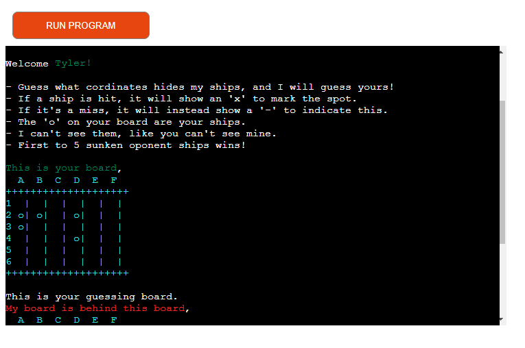

# Battleships

A version of the classic battleship game built by use of python.

The purpose of this application is to provide the user with a playable battleship game built with specifically python.

The application gives the user a compitition against a generated oponent. The landing page will great the user with the question of if they are intrested in playing a game of battleship, and if so to enter their name. If the user chooses to enter their name, they will be welcomed to the game, the users playing board will be generated as will a guessing board. The user will be asked to input coordinates as guesses and the oponent has their guess randomly generated. When one of the two have sunken all of the others ships, the user is informed of the winner and asked if they wnat to restart the game. If yes, the playing boards are cleared and ships generated again. If not, the game loop is exited and the user recives a message to indicate that they have left the game.

[LIVE SITE HERE](https://battleships-python-game.herokuapp.com/)

## Features

### Landing page

The landing page introduces the user with what it is, through a question of if the user wants to play a game of battleship. It also asks for the users name to initite the game.  

 

### Game start

After providing their name, the user is introduced to how the game works. They are shown their own board and a guessing board, hiding the oponents board, and asked to make a guess of on which cordinates hides the oponents ships.

 

### Coordinates entered

As the coordinates have been entered, the user is informed of the round results. In the case bellow, the computer found one of the users ships and the user missed. The results will also be shown on the users board and guess board. This is done to show a visual representation of where both the computer and user have guessed, as well as how many ships have been hit. 

As neither the user or the computer has found all of the oponents ships, the user is urged to take another guess, and the game continues in the same fashion.

 

### Winner is anounced

When either the computer or the user has sunken all of the oponents ships, the game ends and the winner is anounced. In the case bellow, the game ended with the user winning. But the game can also end with the computer winning or as a draw. In those cases the message displayed will reflect that reult.

As the game has ended, the user is faced with the question of if they want to restart the game.

 

### Continue playing

The user can now choose to either restart the game or end the game. If they choose to restart the game, all boards will reset, the ship placement will be rerandomized and a message will indicate that the game is restarted. 

Each game is it's own and the program will not keep count of how many games each party has won. 

 

If the user chooses to end the game, they will exit the game and a message will indicate that they have left.

 

## Future implementations

A future vertion of the app will feature a function to keep count of computer and user wins between different games. So the games played between computer and user will be connected instead of being completely seperate games.

 

## Wireframe

The wireframe for the project provided a thread to follow through out the project and didn't really change through out the process of building the code. The original wireframe was drawn on paper and later transfered to digital media through [Lucidchart](https://www.lucidchart.com/pages/).

The only element that was added on after the fact was "reset playing boards". As it was an aspect that I had not considered when making the original version.

Original wireframe

Original wireframe (Made with [Lucidchart](https://www.lucidchart.com/pages/))

Final wireframe (Made with [Lucidchart](https://www.lucidchart.com/pages/))

 

## Technologies used

The following technologies and languages where used during the development of this project,

- Python
- Git, 
 <i>Was used to commit through Gitpod repository and push code to GitHub.</i>

- [GitHub](https://github.com/),
 <i>Was used to facilitate my project</i>

- [CI Python Linter](https://pep8ci.herokuapp.com/#),
 <i>Was used to lint my python code.</i>

- [Lucidchart](https://www.lucidchart.com/pages/),
 <i>Was used to make a clean wireframe.</i>

- [Heroku](https://id.heroku.com/login),
 <i>Was used to deploy my code.</i>

 

## Testing

Testings have been conducted continuously during each addition in the development process.

### Bugs found during development

- When testing the "gen_ship" function, used for randomly placing 5 ships on the board, there where an instance of only 4 ships appearing. Presumably as two randomly generated coordinates corresponded with eachother.  
<i> To fix the bug, a while loop was added to rerandomize coordinates if they corresponded with a space already occuiped by a "ship".</i>

 

- When testing the coordinate input valitations, I found that a empty string would be accepted as input.  
<i>To fix this bug, an additional try statement was made for both row and column input. The try statment effectively stopt the user from being able to enter empty input and printed a corresponding message to tell them why it didn't work.</i>

 

- When testing the coordinate input valitations, while loop checking for repeated coordinates guess printed try statement message and did not exit loop. Creating an infinate loop.  
<i>To fix this bug, a call to the "player_guess" function was made bellow the try statement message. Making the user enter new coordinates.</i>

 

- When testing the game as a whole, it was discovered that the computer generated coordinate guess would rerandomize when hitting a "miss" but would change a previous "hit" to a "miss" if hi.  
<i>To fix this bug, a corresponding condition was added to the already existing while loop, checking for repeate coordinate guess on "miss" occupied coordinate.</i>

 

- When testing the game as a whole, it was descovered that the user could override a previous "hit" with a miss if the same coordinates was guessed again.  
<i>To fix this bug, a corresponding condition was added to the already existing while loop, checking for repeate coordinate guess on "miss" occupied coordinate. Printing a try statement message that user cannot guess an aleady guessed set of coordinates.</i>

 

### Linter testing

The [CI Python Linter](https://pep8ci.herokuapp.com/#) was used to lint the project python code. It first came back with minor errors regarding mainly PEP8, that were fixed at some code readability cost. It was later linted again and came back without errors as shown in the image bellow,

 

## Credits

Credits for this project goes to following, for following reasons,

- Knowledge Mavens and his video "[How to Code Battleship in Python - Single Player Game](https://www.youtube.com/watch?v=tF1WRCrd_HQ&t=581s)",
 <i>For supplying me with a generall understanding of python battleship games, the building of my playing boards, the functions "gen_ships" and "ships_hit" in my code and some of my validations for user input.</i>

- [StackAbuse](https://stackabuse.com/how-to-print-colored-text-in-python/),
 <i>For giving instructions on how to add color to my python code.</i>

- Oskar Johansson and Joakim Karlsson, 
 <i>For helping me through hints and support on queries I had through out the project.</i>

- [W3 Schools](https://www.w3schools.com/), [Stack Overflow](https://stackoverflow.com/) and Code Institute Tutors, 
 <i>For answering any query I had along the way.</i>